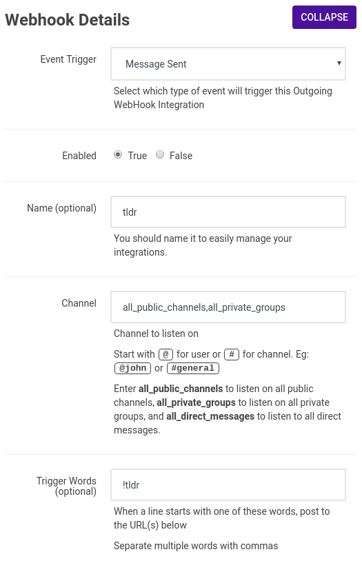

# Rocket.Chat Summary Bot (tldrbot)
## What is this?
Provides summarization functionality for articles and scrollback to Rocket Chat

Uses [Sumy](https://github.com/miso-belica/sumy) to generate the summaries. If no link is found in the message before !tldr is called in chat, tldrbot tries to generate a summary of scrollback (the last 250 messages by default). Sumy isn't really designed for this, so it's hit or miss. Further investigation/development will be needed.


If the previous message includes a link, tldrbot will attempt to summarize the content on the page linked. This works better, as this is closer to what Sumy was designed for.


## Dependencies
In order to securely run this integration you need a web server or proxy capable of terminating TLS such as `nginx` or `apache`. You also need Python version 3 and `pip` and `virtualenv` to get started.

It is possible to skip the TLS setup if you install this integration on the same system that runs Rocket Chat and simply access the integration over `localhost`.

## Installation
Installation is not automated (yet?).

1) Clone the repo to, e.g., your home directory
1) In the repository directory, create a virtualenv e.g. `virtualenv tldrbot`
1) Activate the virtualenv e.g. `source tldrbot/bin/activate`
1) Install Python dependencies with `pip install -r requirements.txt`
2) Choose a solution for TLS, since this integration uses plain HTTP. I use nginx and its `proxy_pass` to terminate TLS with a Let's Encrypt certificate, e.g.
```
server {
    server_name example.com; # managed by Certbot

    listen [::]:443 ssl; # managed by Certbot
    listen 443 ssl; # managed by Certbot
    ssl_certificate /etc/letsencrypt/live/example.com/fullchain.pem; # managed by Certbot
    ssl_certificate_key /etc/letsencrypt/live/example.com/privkey.pem; # managed by Certbot
    include /etc/letsencrypt/options-ssl-nginx.conf; # managed by Certbot
    ssl_dhparam /etc/letsencrypt/ssl-dhparams.pem; # managed by Certbot

    location / {
	    proxy_pass http://localhost:8080;
    }
}
```
6) Create an Outgoing WebHook Integration through the rocket.chat admin panel. Currently the command used to trigger the bot is not configurable, so match the Event Trigger, Enabled, Channel, and Trigger Words fields in this screenshot while installing your integration. Set the `URLs` field to include the fully qualified domain of your summarizer. 



7) Copy the systemd unit file to `/etc/systemd/system/` and add your environment variables to that file:
  - `SUMMARIZER_USERNAME=` should be a user on your Rocket Chat instance that has the necessary permissions to read channels and post messages
  - `SUMMARIZER_PASSWORD=` should be the password for the account above
  - `SUMMARIZER_SECRET=` allows tldrbot to reject unauthorized requests for summaries. This value comes from the `Token (optional)` field in the Integration panel in Rocket Chat.
  - `SUMMARIZER_SITENAME=` is the fully qualified domain name where your Rocket Chat instance lives, e.g. `example.com` or `rocket.chat` -- do not specify `https://` here.

8) Fill out the other necessary details in the template:
   - Set `User` to the username of the user that will be executing the integration
   - Set the `WorkingDirectory` to the location where you cloned the repo: `WorkingDirectory=/path/to/summarizer`
   - Set `ExecStart` to call the Python binary in your virtualenv with the full path to `summarizer.py` as its argument, e.g. `ExecStart=/path/to/summarizer/repo/virtualenv/bin/python /path/to/summarizer/summarizer.py`

9) Run `systemctl enable --now summarizer` to start the service and enable it to run at startup.
