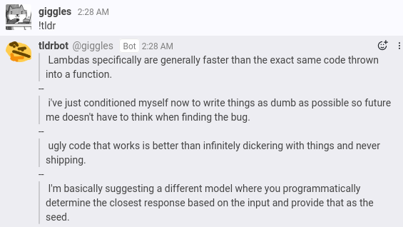
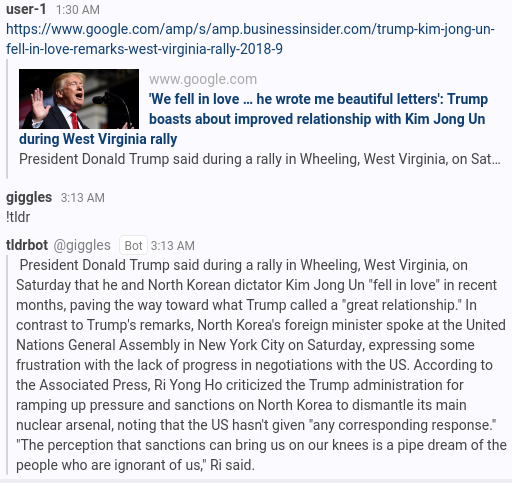

# Rocket.Chat Summary Bot (tldrbot)
Provides summarization functionality for articles and scrollback to Rocket Chat

Uses [Sumy](https://github.com/miso-belica/sumy) to generate the summaries. If no link is found in the message before !tldr is called in chat, tldrbot tries to generate a summary of scrollback (the last 250 messages by default). Sumy isn't really designed for this, so it's hit or miss. Further investigation/development will be needed.

If the previous message includes a link, tldrbot will attempt to summarize the content on the page linked. This works better, as this is closer to what Sumy was designed for.

